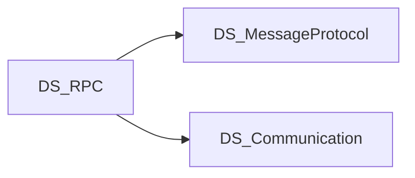

# Scope

## 목적

메시지 타입에 대한 고성능 직렬화/역직렬화를 컴파일 타임 생성 + 런타임 API로 제공한다.

## In scope

- 메시지 계약 및 `MessageSerializer` 런타임
- Roslyn CodeGenerator (생성 코드)
- netstandard2.1 / Unity 호환
- 벤치마크·코어 테스트 (`Test/`)
- 최소 콘솔 예제 (`Examples/MinimalConsole`)

## Out of scope

- 네트워크 전송 (→ DS_Communication)
- RPC 디스패치·원격 호출 (→ DS_RPC)
- 대규모 Sandbox / 튜토리얼 앱 (MinimalConsole 수준만)

## 저장소 구조 (요약)

| 경로 | 포함 |
|------|------|
| `Source/` | MessageProtocol, Core, CodeGenerator, Shared |
| `Test/` | CoreTests, Benchmarks |
| `Examples/` | MinimalConsole |
| `Document/` | 이 vault |
| `.cursor/` | skills (코드 작업용; Document와 별도) |

상세: [[Overview]].

## 의존·형제 프로젝트

- **상위 소비자**: DS_RPC (`DRPC.Shared` 등이 MessageProtocol 연동)
- **형제**: DS_Communication (전송은 별도)
- Cursor skills: `.cursor/skills/messageprotocol-*` (코드 작업 시 참고; Document와 별도 유지)

## 관련

- [[CONTEXT]]
- [[Home]]
- [[Packages]]
- [[Overview]]
