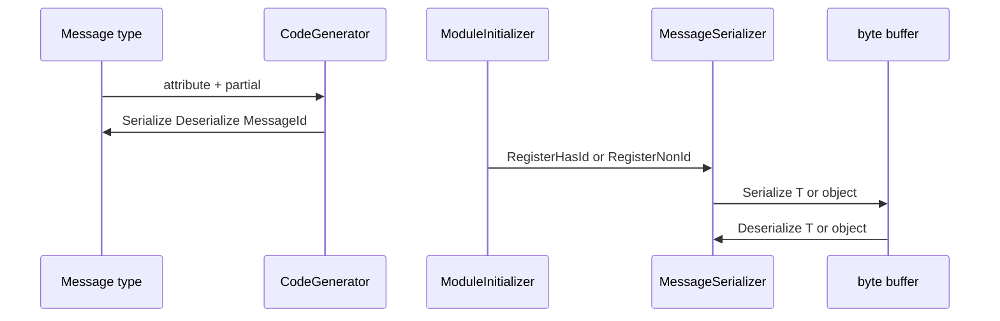

# Data Flow

메시지 정의부터 직렬화/역직렬화까지의 경로.

## Happy path

1. 타입에 메시지 속성(`Standalone` / `GroupRoot` / `GroupElement` / `NonId`)과 `partial`을 붙인다.
2. 컴파일 시 CodeGenerator가 Serialize / Deserialize / (ID면) `MessageId`와 `[ModuleInitializer]`를 생성한다.
3. 모듈 로드 시 `RegisterHasIdMessage<T>` 또는 `RegisterNonIdMessage<T>`가 캐시·디스패치 테이블을 채운다.
4. **Serialize**: `Serialize<T>` / `Serialize(object)` / pooled·writer 오버로드 → 헤더 + payload.
5. **Deserialize**: `Deserialize<T>`는 제네릭 캐시; `Deserialize(byte[])`는 헤더에서 MessageId를 읽어 Standalone/Group 타입으로 라우팅.

## 와이어 헤더

공유 규칙: `Source/Shared/MessageWireFormat.cs`, `MessageFlag.cs`.

| 구성 | 내용 |
|------|------|
| Byte 0 | flags(상위 4비트) + category(하위 4비트) |
| ID 메시지 | 헤더 4바이트. MessageId = `(headerByte << 24) \| (value & 0x00FFFFFF)` |
| NonId | 헤더 1바이트만, 이후 payload |

`MessageId` 값 범위: `0 .. 2^24-1` (`MessageIdValueMask`).

## 디스패치 규칙

| API | 동작 |
|-----|------|
| `Serialize<T>` / `Deserialize<T>` | 등록된 타입의 static 메서드 캐시 |
| `Serialize(object)` | Type → writer 디스패치 (다형성·ID 메시지) |
| `Deserialize(byte[])` / Span | 헤더 flags 검사 후 MessageId → reader. **Standalone / GroupRoot / GroupElement만** |
| NonId + object Deserialize | 불가. `Deserialize<T>` 사용 |

## 에러·재시도

네트워크 재시도는 이 라이브러리 범위 밖([[Scope]]). 직렬화 계층에서의 실패 예:

- 미등록 MessageId / 미등록 Type
- 헤더가 너무 짧음
- NonId를 object `Deserialize`로 호출
- 생성기 진단: MSGPROT001–005 (partial 누락, nested partial, root/element 계층, ID 범위 등)

상세 트러블슈팅: [[FAQ]] (추후 보강).

## 관련

- [[Overview]]
- [[Components]]
- [[Public-API]]
- [[FAQ]]
