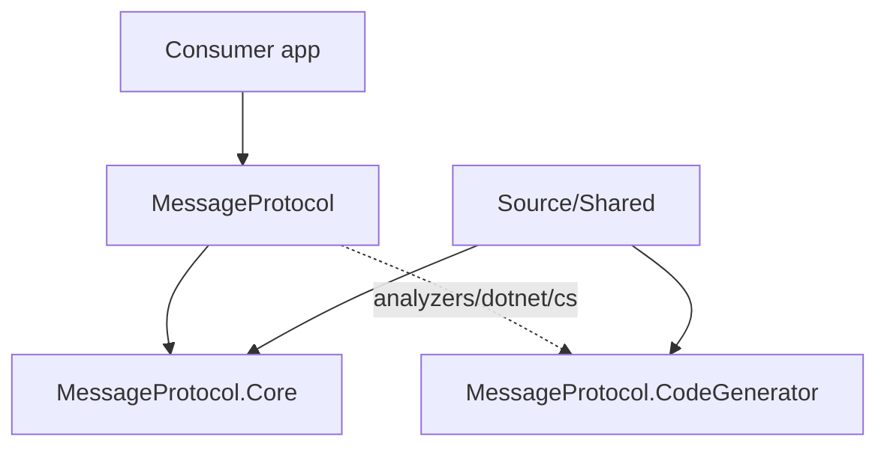

# Architecture Overview

Core(런타임) + CodeGenerator(컴파일 타임) + MessageProtocol(통합 패키지) 3층. 앱은 보통 MessageProtocol만 참조한다.

## 저장소 레이아웃

| 경로 | 역할 |
|------|------|
| `Source/` | 제품 코드: Core, CodeGenerator, MessageProtocol, Shared |
| `Test/` | xUnit 테스트, BenchmarkDotNet |
| `Document/` | Obsidian vault (이 문서) |
| `.cursor/` | 에이전트 skills·rules (Document와 별도) |
| `MessageProtocol.sln` | 솔루션 |

Sandbox / Examples / TemplateSource는 현재 없다.

```
Source/
├── Directory.Build.props          # netstandard2.1, packable
├── Shared/                        # Core+Generator Link Compile
│   ├── MessageFlag.cs
│   └── MessageWireFormat.cs
├── MessageProtocol.Core/          # 런타임 NuGet
├── MessageProtocol.CodeGenerator/ # Roslyn 생성기 NuGet
└── MessageProtocol/               # 통합 meta 패키지
```

## 다이어그램



| 층 | 시점 | 역할 |
|----|------|------|
| **MessageProtocol** | 패키지 참조 | Core 런타임 DLL + CodeGenerator를 analyzer로 묶음 |
| **MessageProtocol.Core** | 런타임 | `MessageSerializer`, 메시지 속성·계약, 버퍼 I/O |
| **MessageProtocol.CodeGenerator** | 컴파일 | 속성 스캔 → Serialize/Deserialize/MessageId + ModuleInitializer |

## 주요 원칙

- 소비 앱은 **MessageProtocol**만 참조하면 된다 (코어·생성기 분리 참조는 고급 시나리오).
- `Source/Shared`의 와이어 상수(`MessageFlag`, `MessageWireFormat`)는 Core와 Generator에 **Link Compile**되어 양쪽이 동일한 헤더 규칙을 쓴다.
- 메시지 타입은 속성 + `partial`로 선언하고, 생성 코드가 `[ModuleInitializer]`로 `MessageSerializer`에 자동 등록한다.
- 네트워크 전송·RPC는 범위 밖 → [[Scope]].

## 관련

- [[Components]]
- [[Data-Flow]]
- [[Packages]]
- [[CONTEXT]]
- [[Known-Issues]] — 구조·성능·병목
