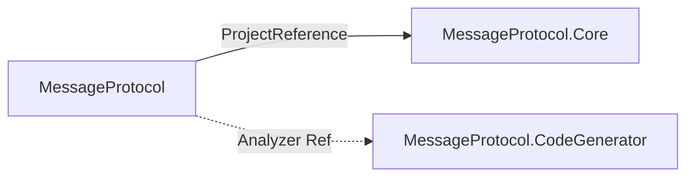

# Packages

버전 2.0.0 (재작성 버전. 패키지 아이디는 v1과 동일).

| NuGet 패키지 | 프로젝트 경로 | TFM | 설명 |
| -------------- | --------------- | ----- | ------ |
| **MessageProtocol** | `Source/MessageProtocol/` | netstandard2.1 | 메인 패키지. Core 런타임 + analyzers에 CodeGenerator |
| **MessageProtocol.Core** | `Source/MessageProtocol.Core/` | netstandard2.1; net6.0 | 직렬화 런타임 API |
| **MessageProtocol.CodeGenerator** | `Source/MessageProtocol.CodeGenerator/` | netstandard2.0 | Roslyn 분석기/소스 생성기 (고급·세분화 참조용) |

## 설치

```bash
dotnet add package MessageProtocol
```

코어만:

```bash
dotnet add package MessageProtocol.Core
```

## 패키지 관계



| 참조 | 방식 |
| ------ | ------ |
| MessageProtocol → Core | 일반 `ProjectReference` (런타임 DLL 포함) |
| MessageProtocol → CodeGenerator | `OutputItemType=Analyzer`, `ReferenceOutputAssembly=false` |
| MessageProtocol pack | `analyzers/dotnet/cs/MessageProtocol.CodeGenerator.dll` 삽입 |
| CodeGenerator pack | `IncludeBuildOutput=false`, analyzer DLL만 `analyzers/dotnet/cs` |
| Shared | Core·Generator 모두 `Compile Include` + Link (`MESSAGE_PROTOCOL_CODE_GENERATOR` 상수로 생성기 측 internal) |

## 버전·빌드 구성

- 패키지 Version은 `Source/Directory.Build.props`에서 중앙 관리 (현재 `2.0.0`).
- 루트 `Directory.Build.props` → 기본 `IsPackable=false` (Test·Sandbox 등), `**/generated-out/**` 컴파일 제외 가드.
- 팩 검증: `dotnet pack MessageProtocol.sln -c Release -o artifacts/packages`.

## 관련

- [Public-API](./Public-API.md)
- [Overview](../02-Architecture/Overview.md)
