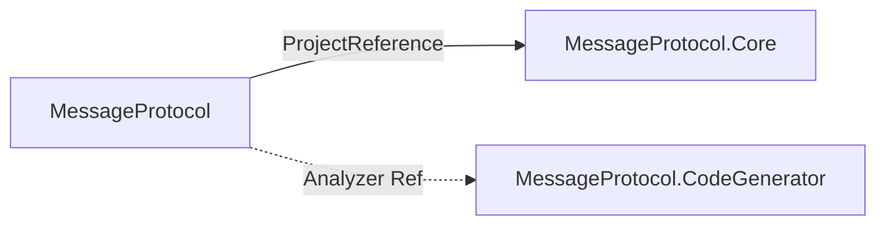

# Packages

| NuGet 패키지 | 프로젝트 경로 | 설명 |
|--------------|---------------|------|
| **MessageProtocol** | `Source/MessageProtocol/` | 메인 패키지. Core 런타임 + analyzers에 CodeGenerator |
| **MessageProtocol.Core** | `Source/MessageProtocol.Core/` | 직렬화 런타임 API |
| **MessageProtocol.CodeGenerator** | `Source/MessageProtocol.CodeGenerator/` | Roslyn 분석기/소스 생성기 (고급·세분화 참조용) |

## 설치

```bash
dotnet add package MessageProtocol
```

코어만:

```bash
dotnet add package MessageProtocol.Core
```

루트 `README.md` 및 NuGet.org 패키지 ID를 참고한다.

## 패키지 관계



| 참조 | 방식 |
|------|------|
| MessageProtocol → Core | 일반 `ProjectReference` (런타임 DLL 포함) |
| MessageProtocol → CodeGenerator | `OutputItemType=Analyzer`, `ReferenceOutputAssembly=false` |
| MessageProtocol pack | `analyzers/dotnet/cs/MessageProtocol.CodeGenerator.dll` 삽입 |
| CodeGenerator pack | `IncludeBuildOutput=false`, analyzer DLL만 `analyzers/dotnet/cs` |
| Shared | Core·Generator 모두 `Compile Include` + Link |

## 버전

- 패키지 Version은 각 csproj에서 관리 (현재 `1.0.1`).
- NuGet 배포: `v*` 태그 push → `.github/workflows/nuget-publish.yml` (`-p:Version`은 태그에서 추출).
- Source 공통: `Source/Directory.Build.props` → `TargetFramework=netstandard2.1`, `IsPackable=true`.
- 루트 `Directory.Build.props` → 기본 `IsPackable=false` (Test 등).

상세: [[Configuration]].

## 관련

- [[Public-API]]
- [[Configuration]]
- [[Components]]
- [[Scope]]
